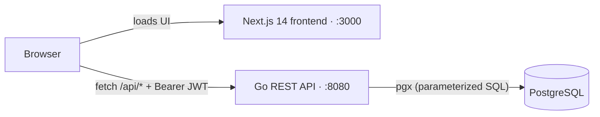

# Expenzo — Full-Stack Expense Tracker

A personal expense tracker built as a **decoupled full-stack application**: a
React/Next.js frontend talking to a standalone **Go REST API** backed by
**PostgreSQL**, with **JWT authentication** and per-user data isolation.

> Money is modeled the way payment systems do it (integer minor units, never
> floats), the persistence layer sits behind an interface (in-memory ↔ Postgres
> are swappable), and every query is scoped to the authenticated user.

---

## Architecture



The frontend and backend are independent services (separate ports locally,
separate deployables in production). The Go API is a clean layered service and
could be consumed by other clients — e.g. a future native mobile app — using the
same endpoints.

```
Request → CORS/logging middleware → JWT auth middleware → Handler → Service → Store → PostgreSQL
                                    (controller)   (business rules)  (interface)
```

## Tech stack

| Layer     | Technology |
|-----------|------------|
| Frontend  | Next.js 14 (App Router), TypeScript, Tailwind CSS |
| Backend   | Go (standard-library `net/http`, Go 1.22 routing) |
| Database  | PostgreSQL (via `pgx/v5` + connection pool) |
| Auth      | JWT (HS256) · bcrypt password hashing |
| Charts    | Hand-built SVG/CSS (no charting dependency) |

## Features

- Email/password **registration & login**, JWT-based sessions
- **Per-user data isolation** — you only ever see your own expenses
- Add / edit / delete expenses (date, amount, category, description)
- **Dashboard**: total / monthly / average summaries, category donut chart,
  6-month spending bar chart
- **Search + category + date-range** filtering
- **CSV export** of the current view
- Responsive UI (desktop table ↔ mobile cards), loading/empty/error states

## Repository layout

```
.
├── app/                # Next.js App Router pages (dashboard, expenses, login)
├── components/         # UI + AuthProvider (React context) + charts
├── hooks/              # useExpenses, useAuth, useToast
├── lib/                # api client, auth-token store, formatting, CSV, analytics
└── expense-api/        # Go backend (its own module)
    ├── cmd/server/     # main.go (composition root) + middleware
    ├── internal/
    │   ├── expense/    # model · store (interface + memory + postgres) · service · handler
    │   ├── auth/       # password (bcrypt) · token (JWT) · middleware · handlers
    │   └── user/       # user model + store
    └── db/             # schema.sql + migrations
```

## Getting started (local)

**Prerequisites:** Node.js 18+, Go 1.22+, PostgreSQL 15+.

**1. Database**

```bash
createdb expense_tracker
psql -d expense_tracker -f expense-api/db/schema.sql
```

**2. Backend** (`expense-api/`)

```bash
cd expense-api
cp .env.example .env          # set DATABASE_URL and JWT_SECRET
#   DATABASE_URL=postgres://USER@localhost:5432/expense_tracker?sslmode=disable
#   JWT_SECRET=$(openssl rand -hex 32)
go run ./cmd/server           # serves http://localhost:8080
```

**3. Frontend** (repo root)

```bash
cp .env.example .env.local    # NEXT_PUBLIC_API_URL=http://localhost:8080
npm install
npm run dev                   # serves http://localhost:3000
```

Open http://localhost:3000, register an account, and start tracking.

## API

All `/api/expenses` routes require an `Authorization: Bearer <token>` header.

| Method | Path                     | Description                     | Auth |
|--------|--------------------------|---------------------------------|:----:|
| POST   | `/api/auth/register`     | Create account, returns a JWT   |  —   |
| POST   | `/api/auth/login`        | Log in, returns a JWT           |  —   |
| GET    | `/api/expenses`          | List the user's expenses        |  ✓   |
| POST   | `/api/expenses`          | Create an expense               |  ✓   |
| PATCH  | `/api/expenses/{id}`     | Update an expense               |  ✓   |
| DELETE | `/api/expenses/{id}`     | Delete an expense               |  ✓   |
| GET    | `/health`                | Liveness probe                  |  —   |

## Engineering highlights

- **Interface at the persistence boundary.** `Store` is an interface with two
  implementations (`MemoryStore`, `PostgresStore`); swapping storage is a
  one-line change in the composition root, and the in-memory version doubles as
  a fast test double.
- **Money as integer cents**, never floating point — the same approach Stripe
  uses, avoiding rounding errors in financial math.
- **Multi-tenant isolation enforced in SQL.** Every query is scoped by
  `user_id`; requesting another user's resource returns `404` (not `403`) so the
  API never leaks whether a record exists.
- **Stateless JWT auth** (HS256) with **bcrypt**-hashed passwords; the signing
  secret and DB URL come from environment variables, never source.
- **Defense in depth at the database:** `CHECK (amount_cents > 0)`, a
  `UNIQUE` email constraint, and a `user_id` foreign key with `ON DELETE CASCADE`.
- **Parameterized queries** everywhere (no string-built SQL → no injection).
- **Semantic REST**: `201 Created`, `204 No Content`, `401`, `404`, `422`.
- **Minimal dependency surface** — standard-library HTTP routing (Go 1.22), and
  charts drawn by hand instead of pulling a charting library.

## Roadmap

- [ ] Automated tests (Go unit/integration) + CI (GitHub Actions)
- [ ] Deploy (frontend to Vercel, API + Postgres to a cloud provider)
- [ ] Installable PWA for mobile home screens
- [ ] Bank/card transaction import (Stripe / Plaid sandbox)

## Notes

This is a demo/learning project. Secrets live only in gitignored `.env` files;
the committed `*.env.example` files document the required variables.
